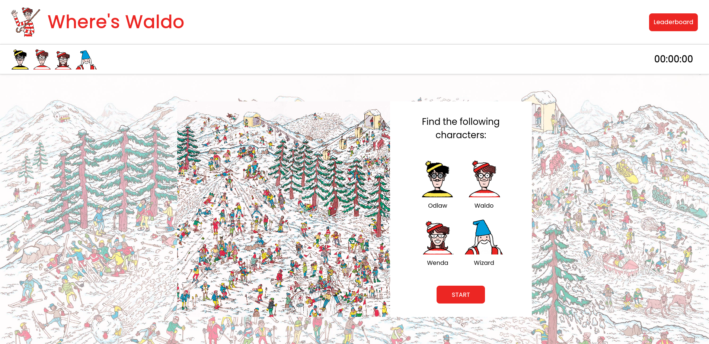

# The Odin Project - Where's Waldo (A Photo Tagging App)

This is a solution to the [Where's Waldo (A Photo Tagging App) project](https://www.theodinproject.com/paths/full-stack-javascript/courses/javascript/lessons/where-s-waldo-a-photo-tagging-app) from [The Odin Project](https://www.theodinproject.com/paths) JavaScript curriculum.

## Table of contents

- [Overview](#overview)
  - [The challenge](#the-challenge)
  - [Screenshot](#screenshot)
  - [Links](#links)
- [My process](#my-process)
  - [Built with](#built-with)
  - [What I learned](#what-i-learned)
  - [Continued development](#continued-development)
- [Author](#author)
- [Acknowledgments](#acknowledgments)

**Note: Delete this note and update the table of contents based on what sections you keep.**

## Overview

### The Project

Users should be able to:

- Play the Where's Waldo game by finding characters in the image and clicking them.
- See which characters were already found and the time elapsed on the top bar.
- Save their score and check the high scores on the leaderboard.
- Switch between the game page and the leaderboard page.

### Screenshot

### Links

- Repository URL: https://github.com/fernanda-veiga/wheres-waldo
- Live Website URL: https://fernanda-veiga.github.io/wheres-waldo/

## My Process

### Built With

- HTML, CSS, JavaScript
- [React](https://reactjs.org/) - JS Library
- [date-fns](https://date-fns.org/) - JS Library
- [Webpack](https://webpack.js.org/) - JS Module Bundler
- [React Router](https://reactrouter.com/) - React Library
- [Firebase Firestore](https://firebase.google.com/products/firestore?gclid=Cj0KCQjw4ImEBhDFARIsAGOTMj9g2G7IxnVcfIUEMlujuK0Kl95Mv33M-DO-xXJ5lFielkzrHyl4gxwaAtK7EALw_wcB&gclsrc=aw.ds) - Cloud Database

### What I Learned

With this project, I learned how to use Firebase as a back-end to a React app. For this project, I worked with Firestore and learned how to store and read data from it. I stored sensitive information (the character's positions) and growing data (player's scores and names). For the leaderboard data, I learned how to display the information from Firestore in order and limited. By using Firebase, I could practice fetching data with APIs in a React environment.

### Continued Development

For this project, in the future, I plan to:

- Optimize the images loading.
- Add mobile responsiveness.
- Build the counter as a React component.
- Add more levels.

## Author

- Github - [@fernanda-veiga](https://github.com/fernanda-veiga)
- Linkedin - [Fernanda Veiga](https://www.linkedin.com/in/fernandarochaveiga/)

## Acknowledgments

The series "Where's Waldo", and all images associated with it, are owned by Martin Handford.
